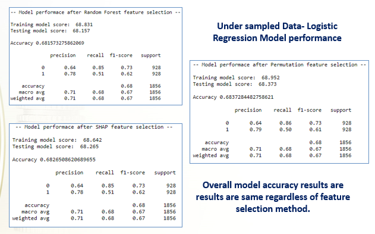
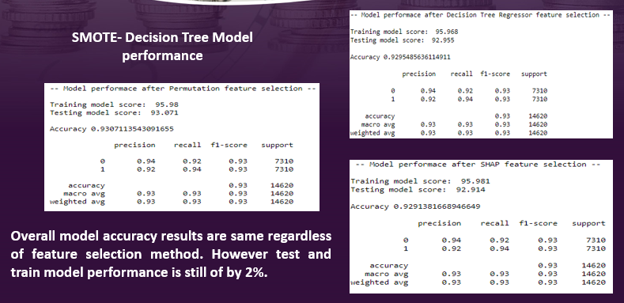

# Bank Term Deposit - Marketing Prediction

### Problem Statement:

The data is related with direct marketing campaigns of a Portuguese banking institution. The marketing campaigns were based on phone calls. Often, more than one contact to the same client was required, in order to assess if the product (bank term deposit) would be ('yes') or not ('no') subscribed.

### Business understanding:

A Term Deposit is a deposit that is held at a financial institution that has a fixed term. These are generally short-term with maturities ranging from a month to a few years. Term deposits are an extremely safe investment and therefore very appealing to conservative, low-risk investors. Instead of mass marketing, the bank has chosen to be more proactive in identifying potential buyers and communicate straight to the customer via telephone calls. Direct marketing is useful here because its positive results can be measured directly. The goal of this project is to perform post-campaign analytics to identify the potential subscribers of the term deposit product for future campaigns.

### Data Set:

#### The UCI Machine Learning Repository datasets:

- bank-additional-full.csv with all examples (41,188) and 20 inputs, ordered by date (from May 2008 to November 2010), very close to the data analyzed in [Moro et al., 2014]
- bank-additional.csv with 10% of the examples (4,119), randomly selected from 1), and 20 inputs

#### Target Feature:

The classification goal is to predict if the client will subscribe (yes/no) a term deposit. The target feature has two classes and hence it is a binary classification problem. 

### Data Exploration:

Record count: 41,188 
Feature count: 21	
11 Categorical features
9 Numerical features 

Target Variable: 
* Yes: 4,640
* No: 36,548
* 11.3% success rate
				
The dataset was relatively clean – no null or missing values.

Following categorial features were converted to binary or numbers:
- Target variable - converted from ‘yes’ and ‘no’ as binary [0,1].
- job - converted job titles to ranks (0-11) based on the type of job. 
- education - converted education degree to ranks (0-7) based on the type of job.
- contact - converted from ‘cellular’ and ‘telephone’ as binary [0,1].
- marital, housing, loan, poutcome, month, days_of_week – used pandas get_dummies to add them as features in the dataframe.

pdays – feature was dropped from dataframe as it had 39,673 (96.32%) records classified with value 999 which appears to be either unknown or data was not captured correctly

### Data Visualization:

- Feature data distribution: There seems to be very little normality, that won’t pose a problem for machine learning models.

- Pair plot: It gives a clear indication that the data is overlapping for most of the feature. So logistic regression will not give us a good results. We should look at KNN model first and then compare it with decision tree and random forest model.

### Modelling and Analysis:

Following algorithm will be used to compare the results:
- Logistic Regression
- Decision tree
- Random Forest
- K-Nearest Neighbors

Following algorithms will be used for feature selection:
- Random Forest
- Permutation feature selection
- Shap (SHapley Additive exPlanations)

### Logistic Regression Model:

Steps 1: Base Model (with no parameter, Under Sampling and Over Sampling techniqs to handle unbalanced data)

 

Step 2:  Build Model with feature selection techniques and under sampling technique to handle unbalanced data.

 

Step 3:  Build Model with feature selection techniques and over sampling technique to handle unbalanced data.

 

Step 4:  Build Model with feature selection techniques and SMOTE technique to handle unbalanced data.

 

Step 5:  Build Model with feature selection techniques, SMOTE technique to habdle unbalanced data and cross validation.

 

### Decision Tree Model:

Steps 1: Base Model (with no parameter, Under Sampling and Over Sampling techniqs to handle unbalanced data)

 

Step 2:  Build Model with feature selection techniques and under sampling technique to handle unbalanced data.

 

Step 3:  Build Model with feature selection techniques and over sampling technique to handle unbalanced data.

 

Step 4:  Build Model with feature selection techniques and SMOTE technique to handle unbalanced data.

 

Step 5:  Build Model with feature selection techniques, SMOTE technique to habdle unbalanced data and cross validation.

 

### KNN Model 

Steps 1: Base Model (with no parameter, Under Sampling and Over Sampling techniqs to handle unbalanced data)

 

Step 2:  Build Model with feature selection techniques and under sampling technique to handle unbalanced data.

 

Step 3:  Build Model with feature selection techniques and over sampling technique to handle unbalanced data.

 

Step 4:  Build Model with feature selection techniques and SMOTE technique to handle unbalanced data.

 

Step 5:  Build Model with feature selection techniques, SMOTE technique to habdle unbalanced data and cross validation.

 

### Random Forest Model:

Steps 1: Base Model (with no parameter, Under Sampling and Over Sampling techniqs to handle unbalanced data)

 

Step 2:  Build Model with feature selection techniques and under sampling technique to handle unbalanced data.

 

Step 3:  Build Model with feature selection techniques and over sampling technique to handle unbalanced data.

 

Step 4:  Build Model with feature selection techniques and SMOTE technique to handle unbalanced data.

 

Step 5:  Build Model with feature selection techniques, SMOTE technique to habdle unbalanced data and cross validation.

 

### Model performance Comparison:

Let's compare all models. Save Random Forest Model.

 

### Directories:
- data\featureData: feature_dataframe.csv file is data file of all features converted in numerical format for modelling.

- data\results: Contains following files:
    - LogisticRegression.csv:  Logistic Regression Model performace data.
    - DecisionTree.csv: Decision Tree Model performace data.
    - KNNClassifier.csv: KNN Model performace data.
    - RandomForest.csv:  Random ForestModel performace data.         

- data/model: randomForest_finalized_model.pickle is a final model file.  

